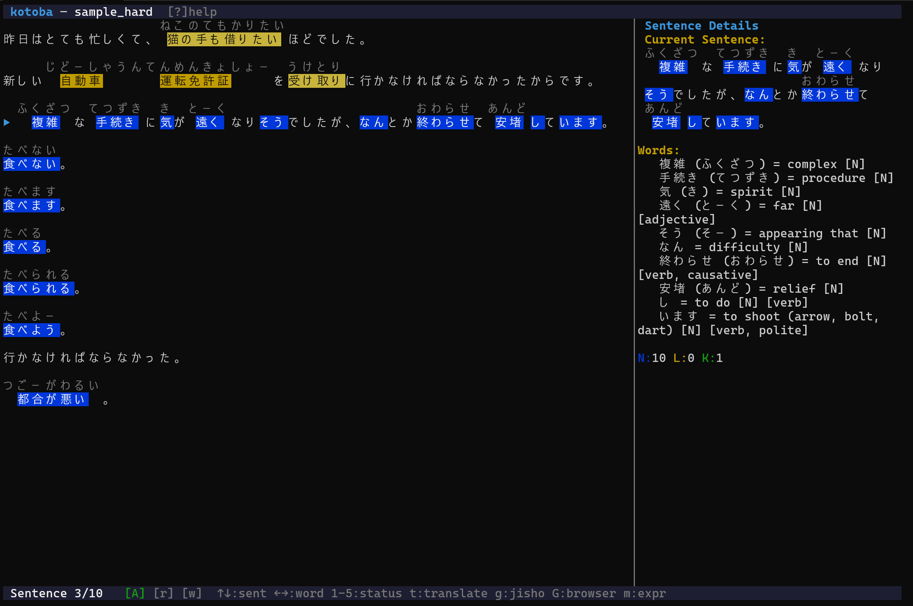

# kotoba

A terminal-based Japanese language learning app. Read native content, look up
words, track vocabulary, and review with spaced repetition -- all without
leaving the terminal.

Built with Rust, [Ratatui](https://ratatui.rs), SQLite, and the
[lindera](https://github.com/lindera/lindera) morphological analyzer with the
UniDic dictionary.

<p align="center">
  
</p>

## Features

- **Immersive reader** -- sentence-by-sentence reading with furigana, color-coded
  vocabulary status, and a sidebar showing readings, POS, dictionary definitions,
  and conjugation info
- **Automatic tokenization** -- Japanese text is split into words using
  lindera/UniDic, with conjugation grouping and multi-word expression detection
- **Vocabulary tracking** -- every word you encounter is tracked; mark words as
  New, Learning (1-4), Known, or Ignored
- **Spaced repetition** -- FSRS-powered flashcards with word recall and sentence
  cloze modes, optional typed reading input
- **JMdict integration** -- offline Japanese-English dictionary with ~200k entries
- **LLM analysis** -- optional sentence breakdown via any OpenAI-compatible API
  (OpenRouter, Ollama, LM Studio, etc.)
- **Multiple import formats** -- plain text, EPUB, SRT/ASS subtitles, web URLs,
  Syosetu web novels, clipboard
- **Theming** -- 4 built-in themes (tokyo-night, light, solarized-light, gruvbox)
  plus custom TOML themes
- **Cross-platform** -- Linux, macOS, Windows

## Quick Start

```bash
# 1. Download the latest release for your platform from the Releases page
# 2. Add it to your PATH (see Installation below)

# 3. Set up the dictionary (downloads JMdict, ~25 MB)
kotoba setup-dict

# 4. Import something to read
kotoba import my-text.txt

# 5. Launch
kotoba
```

## Table of Contents

- [Installation](#installation)
- [Getting Started](#getting-started)
- [Usage](#usage)
- [Screens](#screens)
- [Configuration](#configuration)
- [Theming](#theming)
- [CLI Reference](#cli-reference)
- [Keybindings](#keybindings)
- [Building from Source](#building-from-source)
- [Architecture](#architecture)

---

## Installation

### Download a release

Pre-built binaries are available on the
[Releases](https://github.com/youruser/kotoba/releases) page for:

| Platform | File |
|----------|------|
| Linux x86_64 | `kotoba-linux-x86_64.tar.gz` |
| Linux aarch64 | `kotoba-linux-aarch64.tar.gz` |
| macOS x86_64 (Intel) | `kotoba-macos-x86_64.tar.gz` |
| macOS aarch64 (Apple Silicon) | `kotoba-macos-aarch64.tar.gz` |
| Windows x86_64 | `kotoba-windows-x86_64.zip` |

Download the archive for your platform and extract it:

```bash
# Linux / macOS
tar xzf kotoba-linux-x86_64.tar.gz

# Windows (PowerShell)
Expand-Archive kotoba-windows-x86_64.zip
```

This gives you a single `kotoba` binary (or `kotoba.exe` on Windows).

### Adding kotoba to your PATH

To run `kotoba` from any directory, move the binary to a folder that is on
your system's `PATH`:

#### Linux

```bash
# Move to a standard location (create the directory if it doesn't exist)
mkdir -p ~/.local/bin
mv kotoba ~/.local/bin/

# Make sure ~/.local/bin is on your PATH. Add this to ~/.bashrc or ~/.zshrc
# if it isn't already:
export PATH="$HOME/.local/bin:$PATH"

# Reload your shell
source ~/.bashrc   # or source ~/.zshrc
```

#### macOS

```bash
# Option 1: same as Linux
mkdir -p ~/.local/bin
mv kotoba ~/.local/bin/
# Add to PATH in ~/.zshrc:
export PATH="$HOME/.local/bin:$PATH"
source ~/.zshrc

# Option 2: use /usr/local/bin (no PATH changes needed)
sudo mv kotoba /usr/local/bin/
```

> **Note:** On macOS, you may need to remove the quarantine attribute after
> downloading:
> ```bash
> xattr -d com.apple.quarantine kotoba
> ```

#### Windows

1. Create a folder for CLI tools, e.g. `C:\Tools`
2. Move `kotoba.exe` into that folder
3. Add the folder to your PATH:
   - Open **Settings > System > About > Advanced system settings**
   - Click **Environment Variables**
   - Under **User variables**, select **Path**, click **Edit**
   - Click **New** and add `C:\Tools`
   - Click **OK** to save
4. Open a new terminal window -- `kotoba` should now work from any directory

Alternatively, place `kotoba.exe` in any folder already on your PATH (run
`echo %PATH%` in cmd to see the list).

### Runtime dependencies

The binary is fully self-contained -- no external libraries or tokenizer files
are needed. The only optional runtime dependency is:

| Dependency | When needed |
|------------|-------------|
| **curl** | Only for `kotoba setup-dict` (downloads the JMdict dictionary) |

`curl` is pre-installed on macOS and Windows 10+. On minimal Linux systems:

```bash
sudo apt install curl       # Debian / Ubuntu
sudo dnf install curl       # Fedora
sudo pacman -S curl         # Arch
```

---

## Getting Started

### 1. Set up the dictionary

kotoba uses [JMdict](https://www.edrdg.org/wiki/index.php/JMdict-EDICT_Dictionary_Project),
the standard Japanese-English dictionary. Run this once:

```bash
kotoba setup-dict
```

This downloads `JMdict_e.gz` (~25 MB), decompresses it, and imports ~200k
entries into the local database. The file is saved to
`~/.local/share/kotoba/JMdict_e.xml`.

If you already have a copy of `JMdict_e.xml`, import it directly:

```bash
kotoba import-dict /path/to/JMdict_e.xml
```

### 2. Import content

```bash
# Plain text
kotoba import novel.txt

# EPUB
kotoba import book.epub

# Subtitles
kotoba import anime.srt
kotoba import anime.ass

# Web article
kotoba import --url https://example.com/article

# Syosetu web novel (by ncode)
kotoba syosetu n9669bk

# System clipboard
kotoba import --clipboard
```

You can also import from within the TUI by pressing `i` on the Home screen.

### 3. Launch

```bash
kotoba
```

Navigate to a text in the Library (`l`) and press Enter to start reading.

---

## Usage

### Reading workflow

1. Open a text from the Library or Home screen
2. Navigate sentences with **Up/Down** (or `j`/`k`), words with **Left/Right** (or `h`/`l`)
3. The sidebar shows the selected word's reading, part of speech, conjugation,
   and JMdict definitions
4. Mark vocabulary:
   - `1`-`4` -- Learning stages (auto-creates an SRS card)
   - `5` -- Known
   - `i` -- Ignored (particles, trivial words)
5. New words are auto-promoted to Known when you advance past a sentence
   (toggle with `a`, undo with `Ctrl+Z`)
6. Press `t` to translate a word, `T` to translate the full sentence,
   `Ctrl+T` for LLM analysis

### Review workflow

1. Press `r` from the Home screen to start a review session
2. Cards appear as word recall or sentence cloze (if enabled)
3. Rate your recall: `1` Again, `2` Hard, `3`/Space Good, `4` Easy
4. FSRS schedules the next review based on your rating
5. A summary with accuracy stats is shown at the end

---

## Screens

### Home

Dashboard showing a GitHub-style activity heatmap (26 weeks), quick stats
(streak, vocabulary counts, due cards, 7-day accuracy), and a list of recently
read texts with vocabulary coverage bars. Tab switches focus between the heatmap
and text list.

### Library

All imported content sorted and filterable. Standalone texts and multi-chapter
sources (EPUB, Syosetu) are listed together. Sort by date, title, or completion
percentage. Filter by source type. Search with `/`.

### Chapter Select

Paginated chapter list for multi-chapter sources. Each chapter shows its reading
state (not imported, unread, in progress, finished, skipped). Chapters can be
skipped, manually preprocessed, or opened for reading.

### Reader

The main reading interface. The left pane (70%) displays furigana-annotated text
with vocabulary colored by status. The right pane (30%) shows word details:
readings, POS tags, dictionary glosses, conjugation descriptions, and optional
LLM analysis.

### Review

FSRS-powered flashcard review. Word cards show the word and a context sentence;
sentence cards blank a word in context. Optional typed reading input.

### Card Browser

Browse, filter, and manage all SRS cards. Filter by state (Due, New, Learning,
Review, Retired) or type (Word, Sentence). Sort by due date, creation date, or
word.

### Stats

Learning analytics: vocabulary growth chart, status breakdown, SRS review
accuracy, and per-text vocabulary coverage.

### Settings

Two-panel settings editor with categories: General, Reader, SRS, LLM. Changes
are previewed live and auto-saved on exit.

---

## Configuration

kotoba uses a TOML config file. The lookup order is:

1. `--config <path>` CLI flag
2. `~/.config/kotoba/kotoba.toml`
3. `./kotoba.toml`
4. Built-in defaults

Run `kotoba config` to see the active config location and values.

### Example `kotoba.toml`

```toml
[general]
# db_path = "/custom/path/kotoba.db"     # default: ~/.local/share/kotoba/kotoba.db
# jmdict_path = "/custom/path/JMdict.xml" # default: ~/.local/share/kotoba/JMdict_e.xml
theme = "tokyo-night"                     # tokyo-night | light | solarized-light | gruvbox | <custom>

[reader]
sidebar_width = 30          # sidebar width as percentage (10-80)
furigana = true             # show furigana above kanji
sentence_gaps = true        # add spacing between sentences
preprocess_ahead = 3        # chapters to tokenize ahead (0-20)
translation_service = "deepl" # browser translation: "deepl" or "google"

[srs]
new_cards_per_day = 20          # new card limit per session
max_reviews_per_session = 0     # review cap (0 = unlimited)
review_order = "due_first"      # "due_first" or "random"
require_typed_input = false     # type reading for word cards
enable_sentence_cloze = false   # enable sentence cloze card variant
sentence_cloze_ratio = 50       # cloze probability 0-100%

[llm]
endpoint = "https://openrouter.ai/api/v1" # OpenAI-compatible endpoint
api_key = ""                               # API key
model = "google/gemini-3.1-flash-lite-preview"
max_tokens = 2048
```

### LLM setup

kotoba works with any OpenAI-compatible chat completions API. Some options:

| Provider | Endpoint | Notes |
|----------|----------|-------|
| [OpenRouter](https://openrouter.ai) | `https://openrouter.ai/api/v1` | Default. Many models, pay-per-token |
| [OpenAI](https://platform.openai.com) | `https://api.openai.com/v1` | GPT-4o, GPT-4o-mini |
| [Ollama](https://ollama.com) | `http://localhost:11434/v1` | Local, free, no API key needed |
| [LM Studio](https://lmstudio.ai) | `http://localhost:1234/v1` | Local, free, no API key needed |

Set the endpoint, API key, and model in `kotoba.toml` or via the Settings screen.

### Data directory

kotoba stores its database and dictionary in `~/.local/share/kotoba/`:

```
~/.local/share/kotoba/
  kotoba.db          # SQLite database (vocabulary, SRS cards, texts, etc.)
  JMdict_e.xml       # JMdict dictionary (after setup-dict)
  themes/            # Custom theme .toml files
```

---

## Theming

kotoba ships with 4 built-in themes: **tokyo-night** (default), **light**,
**solarized-light**, and **gruvbox**.

### Custom themes

Create a `.toml` file in `~/.local/share/kotoba/themes/`. The filename
(without extension) becomes the theme name. Only specify the colors you want
to override -- everything else falls back to tokyo-night defaults.

See [`theme.toml.example`](theme.toml.example) for the full template with
all available color keys.

```toml
# ~/.local/share/kotoba/themes/my-dark.toml

[base]
bg = "#1e1e2e"
fg = "#cdd6f4"

[palette]
accent = "#89b4fa"
```

Colors are hex strings (`"#RRGGBB"` or `"RRGGBB"`). The theme engine
auto-downgrades to 256-color or 16-color ANSI depending on terminal
capabilities.

---

## CLI Reference

```
kotoba                              Launch the TUI (default)
kotoba run                          Launch the TUI (explicit)
kotoba import <file>                Import a text file (.txt, .epub, .srt, .ass, .ssa)
kotoba import --url <URL>           Import from a web URL
kotoba import --clipboard           Import from system clipboard
kotoba syosetu <ncode>              Import a Syosetu web novel
kotoba syosetu <ncode> -c <N>       Import a specific chapter
kotoba tokenize <text>              Tokenize Japanese text (debug)
kotoba dict <word>                  Look up a word in JMdict
kotoba setup-dict                   Download and set up JMdict
kotoba import-dict <path>           Import a local JMdict XML file
kotoba cache stats                  Show LLM cache statistics
kotoba cache clear                  Clear cached LLM responses
kotoba config                       Show config file location and current settings
```

**Global flags:**

| Flag | Description |
|------|-------------|
| `--config <path>` | Use a custom config file |
| `-h`, `--help` | Show help |
| `-V`, `--version` | Show version |

---

## Keybindings

### Global

| Key | Action |
|-----|--------|
| `q` | Quit (with confirmation) |
| `?` | Toggle help popup |
| `Esc` | Close popup / go back |

### Home

| Key | Action |
|-----|--------|
| `l` | Library |
| `r` | Start review session |
| `i` | Import menu |
| `c` | Card browser |
| `s` | Settings |
| `S` | Stats |
| `f` | Toggle finished texts |
| `Tab` | Switch heatmap / text list focus |
| `Enter` | Open selected text |
| Arrow keys | Navigate heatmap or text list |

### Library

| Key | Action |
|-----|--------|
| `Enter` | Open text / source |
| `s` | Cycle sort order |
| `f` | Cycle source filter |
| `/` | Search |
| `d` | Delete text / source |
| `j`/`k` | Move selection |

### Chapter Select

| Key | Action |
|-----|--------|
| `Enter` | Open chapter |
| `x` | Toggle skip |
| `P` | Preprocess chapter |
| `p`/`n` | Previous / next page |

### Reader

| Key | Action |
|-----|--------|
| `Up`/`Down`, `j`/`k` | Previous / next sentence |
| `Left`/`Right`, `h`/`l` | Previous / next word |
| `1`-`4` | Mark word as Learning 1-4 |
| `5` | Mark word as Known |
| `i` | Mark word as Ignored |
| `t` | Translate selected word |
| `T` | Translate current sentence |
| `Ctrl+T` | LLM sentence analysis |
| `m` | Start expression marking mode |
| `a` | Toggle auto-promotion |
| `Ctrl+Z` | Undo last auto-promotion |
| `c` | Copy word to clipboard |
| `C` | Copy sentence to clipboard |
| `g` | Open word on Jisho.org |
| `G` | Open sentence in translation service |
| `w` | Toggle Known/Ignored in sidebar |
| `r` | Toggle readings in sidebar |
| `Tab` | Return to chapter select |
| `Esc` | Back to library |

### Review

| Key | Action |
|-----|--------|
| `Space`, `3` | Rate: Good |
| `1` | Rate: Again |
| `2` | Rate: Hard |
| `4` | Rate: Easy |
| `Enter` | Reveal answer / open word detail |
| `Left`/`Right` | Navigate context words |
| `Ctrl+L` | LLM sentence analysis |
| `Esc` | End review session |

### Card Browser

| Key | Action |
|-----|--------|
| `Enter` | Card detail popup |
| `f` | Cycle filter |
| `s` | Cycle sort |
| `r` | Reset card |
| `d` | Delete card |

### Stats

| Key | Action |
|-----|--------|
| `t` | Cycle time range (7d / 30d / 90d / All) |
| `Tab` | Switch panel focus |
| `Enter` | Open text in reader |

---

## Building from Source

If you prefer to build from source instead of using a pre-built release:

### Prerequisites

| Dependency | Required | Notes |
|------------|----------|-------|
| **Rust toolchain** | Yes | Edition 2021 or later. Install via [rustup](https://rustup.rs) |
| **C compiler** | Yes | SQLite is compiled from source (`rusqlite` bundled feature) |

No external Japanese dictionary files or tokenizer libraries are needed --
UniDic is embedded in the binary at compile time.

### Build

```bash
git clone https://github.com/youruser/kotoba.git
cd kotoba
cargo build --release
```

The binary is at `target/release/kotoba` (or `target\release\kotoba.exe` on
Windows). Move it to a directory on your PATH as described in
[Installation](#adding-kotoba-to-your-path).

> **Note:** The first build takes several minutes because it compiles SQLite
> from C source and embeds the UniDic dictionary (~300 MB download by cargo).

You can also install directly with cargo:

```bash
cargo install --path .
```

This builds and places the binary in `~/.cargo/bin/`, which is typically
already on your PATH if you installed Rust via rustup.

### Platform-specific build dependencies

#### Linux

Most distributions ship a C compiler by default. On minimal systems:

```bash
# Debian / Ubuntu
sudo apt install build-essential

# Fedora
sudo dnf install gcc

# Arch
sudo pacman -S base-devel
```

#### macOS

Xcode Command Line Tools provide a C compiler. Install if not already present:

```bash
xcode-select --install
```

#### Windows

Install [Visual Studio Build Tools](https://visualstudio.microsoft.com/downloads/)
(select the "Desktop development with C++" workload) or the full Visual Studio
IDE.

Alternatively, build under WSL2 using the Linux instructions.

---

## Architecture

```
src/
  main.rs             TUI event loop and key handlers
  app.rs              Application state and business logic
  config.rs           TOML configuration
  core/
    tokenizer.rs      lindera/UniDic tokenization, sentence splitting,
                      conjugation grouping, MWE detection
    dictionary.rs     JMdict import, lookup, XML parsing
    srs.rs            FSRS scheduling engine
    llm.rs            OpenAI-compatible chat completions client
  db/
    connection.rs     SQLite connection with WAL mode
    schema.rs         20 versioned migrations
    models.rs         Data access layer (CRUD for all tables)
    stats.rs          Aggregate statistics queries
  import/
    text.rs           Plain text import pipeline
    web.rs            URL article extraction
    syosetu.rs        Syosetu novel scraper
    epub.rs           EPUB parser (ZIP + OPF + spine)
    subtitle.rs       SRT and ASS/SSA subtitle import
    clipboard.rs      System clipboard import
    background.rs     3-thread background import worker
  ui/
    theme.rs          Theme engine with color fallback
    screens/          Per-screen rendering (home, library, reader,
                      review, settings, stats, card_browser, etc.)
    placeholder.rs    Loading / empty state placeholders
```

### Key dependencies

| Crate | Purpose |
|-------|---------|
| `ratatui` + `crossterm` | Terminal UI framework |
| `lindera` | Japanese morphological analysis (UniDic embedded) |
| `rusqlite` (bundled) | SQLite database |
| `fsrs` | Free Spaced Repetition Scheduler |
| `clap` | CLI argument parsing |
| `reqwest` | HTTP client for web import and LLM |
| `scraper` | HTML parsing for web import |
| `quick-xml` | XML parsing for JMdict |
| `arboard` | Cross-platform clipboard |
| `chrono` | Date/time handling |

---

## License

This project uses the [JMdict](https://www.edrdg.org/wiki/index.php/JMdict-EDICT_Dictionary_Project)
dictionary, which is the property of the
[Electronic Dictionary Research and Development Group](https://www.edrdg.org/)
and is used in conformance with the Group's
[licence](https://www.edrdg.org/edrdg/licence.html).
